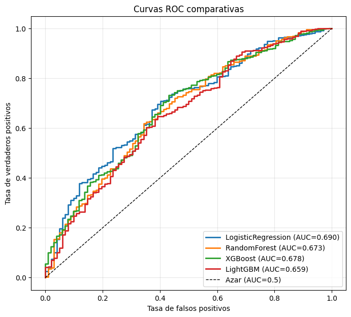
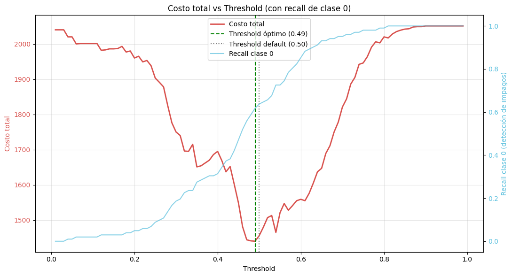
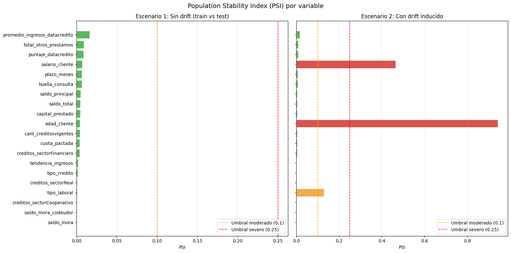

# Modelo de Riesgo Crediticio - Proyecto Integrador Módulo 5

Sistema de Machine Learning para predecir el comportamiento de pago de
clientes de una entidad financiera, desarrollado bajo un enfoque de MLOps
que cubre el ciclo completo: análisis exploratorio, ingeniería de
características, entrenamiento y evaluación de modelos, monitoreo de data
drift, y despliegue mediante una API y un dashboard interactivo.

> **Rol simulado:** Científico de Datos Junior Advanced en el equipo de Datos
> y Analítica de una empresa financiera.

---

## Tabla de contenidos

1. [Caso de negocio](#caso-de-negocio)
2. [Estructura del repositorio](#estructura-del-repositorio)
3. [El dataset](#el-dataset)
4. [Metodología](#metodología)
5. [Hallazgos clave](#hallazgos-clave)
6. [Resultados del modelo](#resultados-del-modelo)
7. [Instalación y uso](#instalación-y-uso)
8. [Stack tecnológico](#stack-tecnológico)
9. [Control de versiones](#control-de-versiones)
10. [Autor](#autor)

---

## Caso de negocio

Las entidades financieras necesitan anticipar el riesgo crediticio de sus
clientes antes de otorgar un crédito. Un modelo que prediga correctamente
quién pagará a tiempo y quién no, permite:

- Reducir las pérdidas por créditos no recuperados.
- Optimizar la asignación de cupos de crédito.
- Tomar decisiones de aprobación más informadas y consistentes.

**Problema concreto:** desarrollar un modelo de clasificación supervisada que
prediga la variable `Pago_atiempo` (1 = el cliente paga a tiempo, 0 = no
paga), utilizando información histórica de créditos.

**Reto principal:** el conjunto de datos está fuertemente desbalanceado
(aproximadamente 95% de clientes que pagan frente a 5% que no), lo que exige
técnicas específicas de manejo de desbalance y una evaluación que vaya más
allá de la exactitud (accuracy).

---

## Estructura del repositorio

```
pim5-riesgo-crediticio/
├── mlops_pipeline/
│   └── src/
│       ├── Cargar_datos.ipynb              # Ingesta del dataset
│       ├── comprension_eda.ipynb           # Análisis exploratorio (EDA)
│       ├── ft_engineering.py               # Pipeline de feature engineering
│       ├── model_training_evaluation.py    # Entrenamiento y evaluación
│       ├── model_deploy.py                 # API de despliegue (FastAPI)
│       └── model_monitoring.py             # Monitoreo de data drift
├── artifacts/
│   ├── data/                               # Datasets transformados (Parquet)
│   ├── transformers/                       # Pipeline serializado + features
│   ├── models/                             # Modelo ganador + threshold + métricas
│   └── monitoring/                         # Baseline de referencia para drift
├── reports/
│   ├── ft_engineering/                     # Visualizaciones del feature engineering
│   ├── model_training/                     # Curvas ROC, PR, matrices de confusión
│   └── monitoring/                         # Reportes de PSI y drift
├── streamlit_app.py                        # Dashboard interactivo
├── Base_de_datos.xlsx                      # Dataset original
├── requirements.txt                        # Dependencias
├── eda_hallazgos.md                        # Documentación detallada del EDA
├── .gitignore
└── README.md
```

> La estructura de `mlops_pipeline/src/` es de obligatorio cumplimiento por los
> procesos de despliegue automatizado (pipelines de validación en Jenkins) y no
> debe modificarse.

---

## El dataset

- **Fuente:** `Base_de_datos.xlsx` (provisto por la entidad financiera).
- **Registros:** 10.763 clientes.
- **Columnas:** 23 (variables financieras y sociodemográficas).
- **Variable objetivo:** `Pago_atiempo` (1 = paga, 0 = no paga).
- **Desbalance:** aproximadamente 95,25% paga frente a 4,75% no paga (ratio ~20:1).

El dataset combina variables numéricas (como `salario_cliente`,
`capital_prestado`, `puntaje_datacredito`) y categóricas (como `tipo_laboral`
y `tendencia_ingresos`).

Para un análisis detallado de cada variable, valores nulos, anomalías y
decisiones de tratamiento, ver [`eda_hallazgos.md`](eda_hallazgos.md).

---

## Metodología

El proyecto se desarrolló en cuatro fases secuenciales, cada una versionada
en Git.

### 1. Análisis exploratorio de datos (EDA)

Exploración univariable, bivariable y multivariable de las 23 variables. Se
identificaron valores nulos, anomalías (edades imposibles, salarios extremos,
puntajes negativos), asimetrías fuertes en variables financieras y un patrón
de desbalance severo en el target.

### 2. Ingeniería de características

Implementada en `ft_engineering.py` mediante un pipeline de scikit-learn que
incluye:

- Limpieza de la variable `tendencia_ingresos` (agrupación de ruido).
- Capping y conversión a nulos de valores anómalos, basados en conocimiento
  de dominio (sin introducir data leakage).
- Transformación logarítmica (`log1p`) para variables con asimetría alta.
- Imputación de nulos (mediana para numéricas, constante para categóricas).
- Codificación one-hot de variables categóricas.
- Escalado estándar de variables numéricas.
- Indicadores binarios para variables con muchos nulos.

El pipeline genera 32 características finales y se persiste serializado para
garantizar reproducibilidad en producción.

### 3. Modelado y evaluación

Implementado en `model_training_evaluation.py`. Se entrenaron y compararon
cuatro modelos de clasificación supervisada con manejo de desbalance:

- Regresión Logística
- Random Forest
- XGBoost
- LightGBM

Cada modelo se optimizó con `RandomizedSearchCV` (validación cruzada
estratificada, k=5). El modelo ganador se afinó adicionalmente con Optuna y
se le aplicó un ajuste de umbral de decisión basado en una función de costo
de negocio.

### 4. Monitoreo y despliegue

- **Monitoreo** (`model_monitoring.py`): detección de data drift mediante PSI
  (Population Stability Index), prueba de Kolmogorov-Smirnov y Chi-cuadrado.
- **Dashboard** (`streamlit_app.py`): aplicación interactiva para predicción,
  visualización de drift y métricas del modelo.
- **API** (`model_deploy.py`): despliegue del modelo mediante FastAPI
  (ver Avance #4).

---

## Hallazgos clave

### Target leakage en la variable `puntaje`

Durante el modelado, los cuatro algoritmos alcanzaron inicialmente un ROC-AUC
perfecto de 1.0, una señal de alerta clásica. El diagnóstico reveló que la
variable `puntaje` tenía una correlación de 0,92 con el target y separaba las
clases de forma casi perfecta, indicando que era un score calculado a
posteriori del comportamiento de pago (no disponible al evaluar un crédito
nuevo). La variable fue excluida, y los modelos pasaron a mostrar un
desempeño realista. Este hallazgo está documentado en detalle en
[`eda_hallazgos.md`](eda_hallazgos.md).

### Desbalance severo del target

Con solo ~5% de casos de impago, la exactitud (accuracy) resulta engañosa: un
modelo que prediga "todos pagan" acertaría el 95% de las veces siendo inútil.
Por ello, la evaluación priorizó ROC-AUC, F1, PR-AUC y especialmente el
**recall de la clase 0** (capacidad de detectar impagos).

### La accuracy puede engañar

Random Forest obtuvo la mayor accuracy (~94%) pero un recall de clase 0 de
apenas ~12%: en la práctica, casi no detectaba impagos. Esto ilustra por qué
la selección no puede basarse en accuracy en problemas desbalanceados.

### El umbral de decisión importa

El umbral por defecto de 0,5 no es óptimo en problemas desbalanceados. Se
implementó un ajuste de umbral por costo de negocio (no detectar un impago se
penaliza ~20 veces más que rechazar a un buen cliente), mejorando la
detección de impagos.

---

## Resultados del modelo

**Modelo seleccionado: Regresión Logística** (optimizada con Optuna).

> **Nota:** los valores a continuación corresponden a una ejecución de
> referencia. Reemplázalos con los de tu archivo
> `artifacts/models/metricas_finales.json` tras ejecutar el pipeline.

| Métrica | Valor |
|---|---|
| ROC-AUC | ~0,69 |
| F1-Score | ~0,78 |
| PR-AUC | ~0,98 |
| Recall clase 0 (impagos) | ~0,63 |
| Umbral óptimo | ~0,48 |

### Comparación de modelos

| Modelo | ROC-AUC | F1 | Recall clase 0 |
|---|---|---|---|
| Regresión Logística | ~0,69 | ~0,78 | ~0,63 |
| XGBoost | ~0,68 | ~0,86 | ~0,48 |
| LightGBM | ~0,66 | ~0,85 | ~0,43 |
| Random Forest | ~0,66 | ~0,97 | ~0,12 |

### Curvas de evaluación





### Monitoreo de drift



El detector se validó en dos escenarios: sin drift (train vs test, donde no se
detectó drift) y con drift inducido artificialmente (donde se detectaron
correctamente las variables modificadas).

---

## Instalación y uso

### Requisitos previos

- Python 3.8 o superior.
- Git.

### 1. Clonar el repositorio

```bash
git clone https://github.com/cfgarciac/pim5-riesgo-crediticio.git
cd pim5-riesgo-crediticio
```

### 2. Crear y activar un entorno virtual

```bash
python -m venv pim5-venv
# Windows
pim5-venv\Scripts\activate
# Linux / macOS
source pim5-venv/bin/activate
```

### 3. Instalar dependencias

```bash
pip install -r requirements.txt
```

### 4. Ejecutar el pipeline

El orden de ejecución es importante, ya que cada script consume artefactos
del anterior:

```bash
# 1. Feature engineering (genera datasets transformados y pipeline)
python mlops_pipeline/src/ft_engineering.py

# 2. Entrenamiento y evaluación (genera el modelo ganador)
python mlops_pipeline/src/model_training_evaluation.py

# 3. Monitoreo de drift (genera reportes de estabilidad)
python mlops_pipeline/src/model_monitoring.py
```

### 5. Ejecutar el dashboard

```bash
streamlit run streamlit_app.py
```

Se abrirá en el navegador (por defecto, `http://localhost:8501`).

---

## Stack tecnológico

- **Lenguaje:** Python
- **Análisis de datos:** pandas, numpy
- **Visualización:** matplotlib, seaborn
- **Machine Learning:** scikit-learn, XGBoost, LightGBM
- **Optimización de hiperparámetros:** Optuna
- **Pruebas estadísticas:** scipy, statsmodels
- **Persistencia:** joblib, pyarrow (Parquet)
- **Dashboard:** Streamlit
- **API:** FastAPI, uvicorn (Avance #4)
- **Control de versiones:** Git, GitHub

---

## Control de versiones

El proyecto sigue un esquema de tres ramas (`developer`, `certification`,
`master`) con etiquetas (tags) por versión:

| Tag | Descripción |
|---|---|
| V1.0.0 | Estructura base del repositorio |
| V1.0.1 | Análisis exploratorio de datos (EDA) |
| V1.1.0 | Pipeline de feature engineering |
| V1.2.0 | Entrenamiento y evaluación de modelos |
| V1.3.0 | Monitoreo de data drift |
| V1.4.0 | Dashboard interactivo en Streamlit |

El flujo de trabajo desarrolla en `developer`, integra en `certification` y
libera en `master` mediante merges sin fast-forward, con commits siguiendo la
convención Conventional Commits.

---

## Autor

**Cristian García**

- Correo: cfgarciac@unal.edu.co
- LinkedIn: https://www.linkedin.com/in/cfgarciac/
- Repositorio: https://github.com/cfgarciac/pim5-riesgo-crediticio
